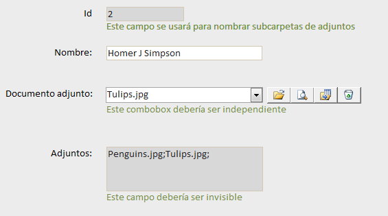

# Adjuntar ficheros a una tabla desde un formulario de MS-Access

Refactorización del módulo de [neckkito](http://siliconproject.com.ar/neckkito/)

<<<<<<< HEAD
=======
## Código

Es un módulo de clase **ClaseArchivosAdjuntos.cls** para una base de datos Microsoft Access.

>>>>>>> 4260a3b539819e00576ffde7133895d9cee7391e
## Características

- Flexibilidad en el nombre de los campos
- Facilitar al máximo su uso desde el formulario
- Poder ser usado en formularios no independientes
- Renombrar variables
- Creación de nuevas funciones para no repetir código
- Reescribir comentarios y eliminar otros
- Eliminar variables globales usadas como locales
- Facilitar renombrado de las carpetas
- Reescritura de código para facilitar su compresión
- Convertirlo en un módulo de Clase
- Añadir propiedad *CarpetaDatos* para separar datos por tablas
- Añadir propiedad *NombreTabla* para indicar la ruta raíz a la BD de tabla vinculada
- Añadir propiedad *CarpetaRaiz* para ubicar exactamente los adjuntos

<<<<<<< HEAD
## Ejemplo

### 1) Tabla

| **id** | nombre | telefono | direccion | **adjuntos** |
|--------|--------|----------|-----------|--------------|
| 1 | Tony Stark | 555 862 458 | Torre Stark, Manhattan, NY | Koala.jpg; |
| 2 | Homer J Simpson | 555 879 324 | Evergreen Terrace, 742, Springfield | Penguins.jpg;Tulips.jpg; |
| 3 | Don Pimpon | | Barrio Sésamo, 1 | |
| 4 | Sherlock Holmes | | Baker Street, 221B, Londres | |

### 2) Formulario

### 3.1) Carpetas y archivos

- CarpetaRaíz/
    - BaseDatos.mdb
    - Adjuntos/
        - TablaDatos/
          - 1/
              - Koala.jpg
          - 2/
              - Penguins.jpg
              - Tulips.jpg
        - Temp/

### 3.2) Carpeta y archivos si la BD tiene los datos vinculados

- CarpetaBDPrincipal/
    - BDPrincipal.mdb
- CarpetaBDVinculada/
    - BDVinculada.mdb
    - Adjuntos/
        - TablaVinculada/
            - 1/
                - Koala.jpg
            - 2/
                - Penguins.jpg
                - Tulips.jpg
        - Temp/

## Código

Es el módulo de clase **ClaseArchivosAdjuntos.cls**.

Este archivo se debería importar desde el Visual Basic (ALT F11) de la base de datos Microsoft Access.

## Requisitos

Registrar estas librerías (>Herramientas>Referencias) desde la ventana de Visual Basic del Access
=======
## Requisitos

Registrar estas librerías (>Herramientas>Referencias)
>>>>>>> 4260a3b539819e00576ffde7133895d9cee7391e

 - Visual Basic For Applications
 - Microsoft Access xx.x Object Library
 - Microsoft Office xx.x Access database engine Object Library // Microsoft DAO Object Library
 - Microsoft Office xx.x Object Library
 - Microsoft Scripting Runtime

## Forma de empleo

<<<<<<< HEAD
### A) Tabla

En la tabla se necesita que exista:

 - un campo indexado sin duplicados, por ejemplo el **id**
 - y un campo de tipo *memo* o *texto largo* llamado por ejemplo **adjuntos**

### B) Formulario

#### Se necesitan 3 controles en el formulario:

  1. Un id que debe ser único y es como se llamarán las subcarpetas dentro de Adjuntos/Datos
=======
### Tabla

En la tabla se necesita que exista:

 - un campo único **id**
 - y un campo de tipo *memo* o *texto largo* **adjuntos**

### Formulario

#### Se necesitan 3 controles en el formulario:

  1. Un id que debe ser único y es como se llamarán las subcarpetas dentro e Adjuntos/Datos
>>>>>>> 4260a3b539819e00576ffde7133895d9cee7391e
  2. Un campo para guardar el nombre de los adjuntos. Debe ser de tipo texto. Debería ser visible=no
  3. Un combobox independiente para seleccionar el documento adjunto actual

#### Variables del formulario:

	  private archivosAdjuntos as ClasearchivosAdjuntos

#### Eventos de formulario:

 - Form_Load=>

		Set archivosAdjuntos = New ClaseArchivosAdjuntos
		archivosAdjuntos.NombreTabla = "Datos"
		archivosAdjuntos.CampoId = me.id
		archivosAdjuntos.CampoAdjuntos = me.adjuntos
		archivosAdjuntos.ComboboxIndependiente = me.comboDocumento
		archivosAdjuntos.Inicializar

 - Form_AfterInsert=>

		Call archivosAdjuntos.Procesar

 - Form_AfterUpdate=>

		Call archivosAdjuntos.Procesar

 - Form_Current=>

		Call archivosAdjuntos.Actualizar
		Call archivosAdjuntos.Asear

#### Botones del formulario:

 - Boton1=>

       Call archivosAdjuntos.BotonElegir

 - Boton2=>

       Call archivosAdjuntos.BotonVer

 - Boton3=>

       Call archivosAdjuntos.BotonExportar

 - Boton4=>

       Call archivosAdjuntos.BotonBorrar
